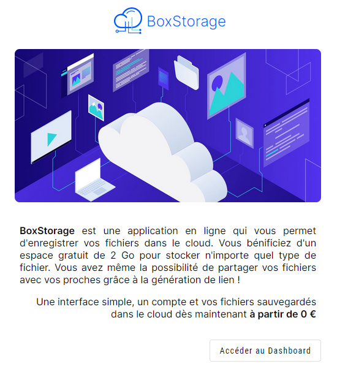

# BoxStorage

## Introduction

Cette application permet de créer un système de cloud en ligne auto-hébergée.

Les fichiers envoyées sont stocker sur une base de données MYSQL dont le schéma correspond au fichier box-storage.sql présent à la racine du dossier.

On utilise deux tables Users et Files pour l'enregistrement des utilisateurs de l'application et l'enregistrement des fichiers uploadée par eux-même !

Cette application est actuellement stateless, aucune session de connexion est établie cotée serveur. L'authentification est maintenue grace au jeton JWT.

La Partie Backend à été développé avec NodeJS (expressJS) et la partie frontend avec Angular 16

